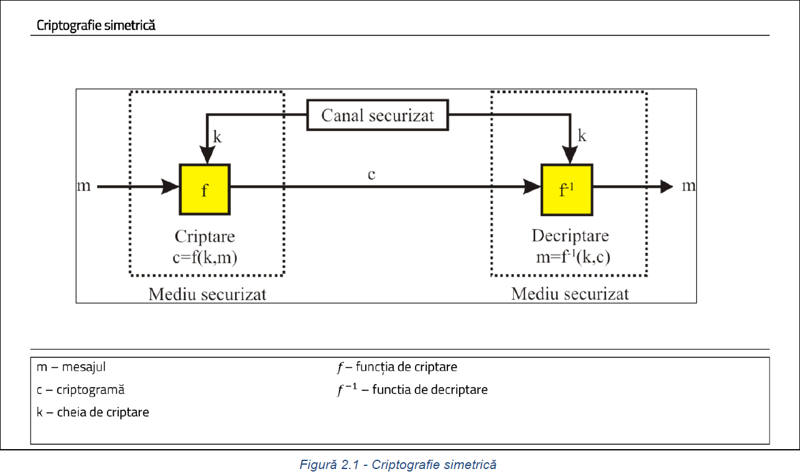
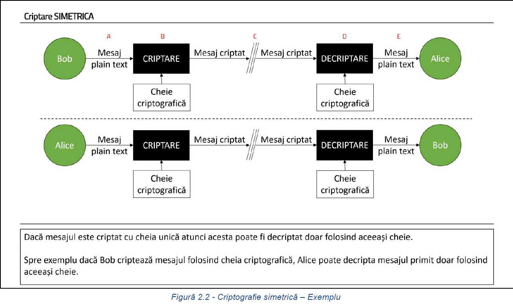
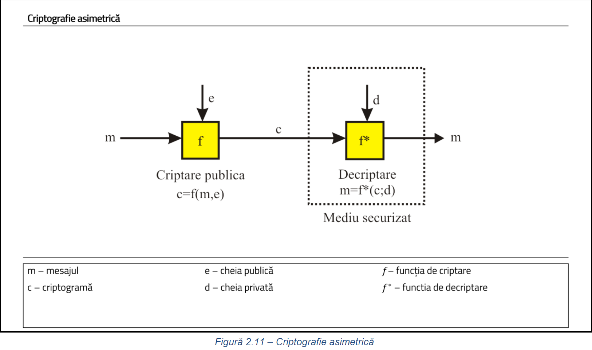
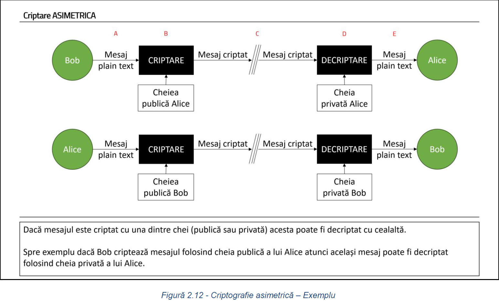

# SD-DOCS
 _**Commands for Data Security lab.**_

# Laboratorul 1
Se vor verifica următoarele „primitive” pe baza cărora vor avea loc laboratoarele de securitate. 
În terminal, se vor rula următoarele comenzi și se va urmări rezultatul lor:
```
whois example.com
host www.example.com
host -a www.example.com
traceroute www.example.com
theharvester -d example.com -l 100 google
```

Pentru a crea o retea virtuala intre doua masini Linux se fac urmatoarele:
```

```


# Laboratorul 2
**_Criptografie, Hashing, SSL/TLS Handshake și Certificate Digitale_**





<br />

**Sistemul de operare Kali Linux are preinstalat aplicația GPG pe care o să o utilizăm în continuare pentru a realiza criptarea simetrică.**

```
gpg –-version
gpg --help
```

Daca, nu e install ```gpg```, se instaleaza cu ```sudo apt-get install gnupg```. 
De asemenea, se poate instala si un GUI pentru ```gpg``` prin care se pot crea chei and stuff. Folositi comanda: ```sudo apt-get install kgpg```

<br />

**Pentru a putea cripta un mesaj folosind gpg putem utiliza următoarea comandă**

forma generala - ```gpg --symmetric --cipher-algo ALGORITM_CRIPTARE MESAJ```

cu algoritmul AES256: ```gpg --symmetric --cipher-algo AES256 original_message.txt```

**În timpul procesului de criptare v-a trebui setată parola de criptare. 
Aceasta reprezintă cheia criptografică care trebuie folosită de celălalt partener al comunicației pentru a putea decripta mesajul primit.**

**Pentru a putea obține un fișier criptat care poate fi vizibil într-un text editor, se poate folosi parametrul ”--armor” în apelul comenzii de criptare:**
```gpg --armor --symmetric --cipher-algo AES256 original_message.txt```

**Pentru a decripta o criptogramă se poate utiliza următoarea comanda din gpg:**
```gpg --output DECRYPTED_MESSAGE --decrypt ENCRYPTED_MESSAGE```

```
gpg --output decrypted_message_asc.txt --decrypt original_message.txt.asc
gpg --output decrypted_message_gpg.txt --decrypt original_message.txt.gpg
```
<br />

```ls -l``` pentru a vedea toate fisierele dintr-un folder
<br />
<br />
```gpg --output decrypted_message_asc.txt --decrypt original_message.txt.asc```  pentru a decripta mesajul original "origianl_message.txt.asc" in "descrypted_message_asc.txt"
<br />
<br />
```cat decrypted_message.txt```  pentru a vizualiza mesajul descriptat
<br />
<br />
```cat original_message.txt.asc```  pentru a vizualiza mesajul encriptat

<br />
<br />

**Sistemul de operare Kali Linux are preinstalat aplicația OpenSSL pe care putem să o utilizăm de asemenea pentru a realiza criptarea simetrică a unui mesaj.**

```openssl --help```

```sudo apt install openssl```  daca nu e instalat

```man openssl```

**Forma generala de comanda pentru criptare cu** ```openssl```:

```openssl ALGORITM_CRIPTARE -e -in MESAJ_ORIGINAL -out MESAJ_CRIPTAT```

```openssl aes-256-cbc -e -in original_message.txt -out encrypted_message.txt```


**Secventa de comenzi:**

```ls -l```

```openssl aes-256-cbc -e -in original_message.txt -out encrypted_message.txt```

```openssl aes-256-cbc -d -in encrypted_message.txt -out decrypted_message.txt```
 
<br />
<br />




**Deoarece criptografie asimetrică are la bază utilizarea unor perechi de chei, primul pas în realizarea acesteia este generarea perechilor de chei necesare.**

```openssl genrsa -out PRIVATE_KEY KEY_SIZE```

```openssl genrsa -out private_key_bob.pem 2048```

**Următorul pas după generarea cheii private este reprezentat de generarea cheii publice**

```openssl rsa -in PRIVATE_KEY -pubout -out PUBLIC_KEY```

```openssl rsa -in private_key_bob.pem -pubout -out public_key_bob.pem```

**Pentru a putea vedea informații despre cheia privată generată anterior se poate utiliza comanda următoare:**

```openssl rsa -in private_key_bob.pem -text -noout```


**Următorul pas este reprezentat de criptarea mesajului folosind cheia publică a lui Alice. Comanda pentru a cripta un fișier este următoarea:**

```openssl pkeyutl -encrypt -in MESAJ_ORIGINAL -out MESAJ_CRIPTAT -inkey CHEIE_PUBLICĂ -pubin```

```openssl pkeyutl -encrypt -in mesaj.txt -out mesaj_criptat_alice.txt -inkey cheie_publica_alice.pem -pubin```

**După ce criptograma a ajuns la Alice, următorul pas este ca Alice să decripteze mesajul criptat primit de la Bob:**

```openssl pkeyutl -decrypt -in MESAJ_CRIPTAT -inkey CHEIE_PRIVATĂ -out MESAJ_DECRIPTAT```

```openssl pkeyutl -decrypt -in mesaj_criptat_alice.txt -inkey private_key_alice.pem -out mesaj_decriptat_de_la_bob.txt```

<br />

**Se poate întâmpla ca mesajele transmise între cei doi participanți ai comunicației să fie interceptate dacă comunicația dintre aceștia se realizează printr-un canal nesecurizat:**

```openssl pkeyutl -decrypt -in mesaj_criptat_bob.txt -inkey private_key_mallory.pem -out decrypted.txt```

```openssl pkeyutl -encrypt -in mesaj_interceptat.txt -out mesaj_catre_alice.txt -inkey public_key_alice.pem -pubin```

```openssl pkeyutl -decrypt -in mesaj_catre_alice.txt -inkey private_key_alice.pem -out mesaj_decriptat_de_la_bob_2.txt```


## Hashing

**Sunt 2 fisiere .txt care se modifica putin, iar apoi se afiseaza hash-ul lor**

```hexdump 00_fisier_original.txt```

```hexdump 01_fisier_modificat.txt```

<br />

**Pentru a putea calcula funcția hash MD5 pentru cele fișiere se poate utiliza utilitarul ```md5sum```**

```md5sum 00_fisier_original.txt```

```md5sum 01_fisier_modificat.txt```

<br />

**Se realieaza hashing-ul unor parole foarte slabe si se salveaza in folderul ```parole```**

```echo -n "Password1" | md5sum | tr -d " –" >> parole```

```echo -n "Password" | md5sum | tr -d " –" >> parole```

```echo -n "password123" | md5sum | tr -d " –" >> parole```

<br />

**Cu ajutorul** ```hashcat``` **se vor gasi parolele initiale. Se face reverse la hashing.**

```hashcat -m 0 parole /usr/share/wordlist/rockyou.txt```


**La adresa** ```/usr/share/wordlist/rockyou.txt``` **se afla un wordlist cu foarte multe parole, dar este** ```.gz```.
**Ca sa-l descriptati folositi** ```sudo gzip -d rockyou.txt.gz```.

<br />

**După ce execuția aplicației s-a terminat, putem rula următoarea comandă pentru a vedea rezultatele obținute**

```hashcat -m 0 parole /usr/share/wordlist/rockyou.txt --show```

**O altă aplicație asemănătoare cu Hashcat foarte des utilizată pentru recuperarea valorilor inițiale ale datelor hash-uite este aplicația John The Ripper.
Primul pas reprezintă pregătirea fișierului care conține valorile funcției de hash MD5 aplicate pe diferite parole slabe**

```echo -n "monitor" | md5sum | tr -d " –" >> passwords```

```echo -n "watch" | md5sum | tr -d " –" >> passwords```

```echo -n "mydog" | md5sum | tr -d " –" >> passwords```

**Pentru a putea rula aplicația John**

```john –format=ALGORITM_HASH –wordlist=WORDLIST FISIER_HASHURI```

```john –format=raw-md5 –wordlist=/usr/share/wordlist/rockyou.txt passowrds```

```john –show -format=Raw-MD5 passwords```

## SSL/TLS Handshake

_**SSL/TLS Handshake este un proces esențial în securitatea comunicării pe internet, care se întâmplă înainte ca datele să fie transmise între un browser web și un server. 
Acest proces asigură că comunicarea este privată și sigură, protejând astfel datele personale și confidențiale ale utilizatorilor.**_


## Certificate digitale

**Primul pas reprezintă generarea certificatului self-signed.**

```openssl req -x509 -newkey TIPUL_SI_DIMENSIUNEA_CHEII_PRIVATE -keyout CHEIE_PRIVATA -out CERTIFICAT -ALGORITMUL_DE_CRIPTARE -days NR_ZILE_VALABILITATE```

```openssl req -x509 -newkey rsa:4096 -keyout private_key.pem -out certificate.pem -sha256 -days 365```

**Pentru a vedea informațiile despre un certificat:**

```openssl x509 certificate.pem -text```

```python server.py```